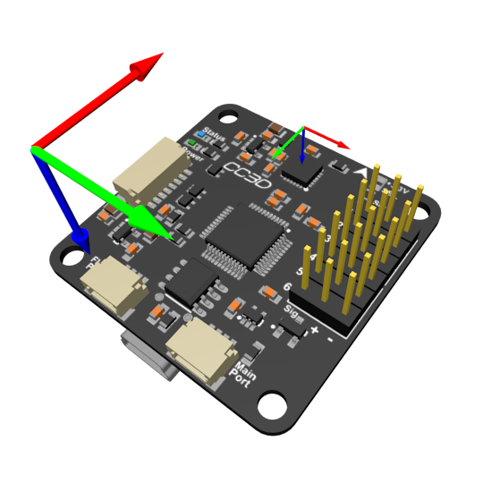
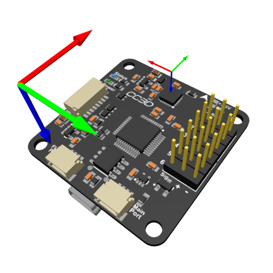

# IMU Orientation Convention

dRonin defines vehicle axes as X forward, Y right, Z down. Bottom sensor orientation is +180 degrees about vehicle X-axis, and is applied first. Sensor rotations are about the vehicle Z-axis, e.g. top 90 degrees is rotated 90 degrees clockwise looking top-down. Note: top 0 degrees is defined with the pin 1 marker closest to the front left corner of the board.

## Invensense IMUs
All known Invensense IMUs share the same gyro/accelerometer convention (with pin 1 at front-left corner): X right, Y forward, Z up. The AKxxxx magnetometer inside MPU9xx0 matches dRonin vehicle convention (X forward, Y right, Z down).

| Orientation            | Gyro X | Gyro Y | Gyro Z | Mag X | Mag Y | Mag Z |
|------------------------|--------|--------|--------|-------|-------|-------|
| PIOS_MPU_TOP_0DEG      | Y      | X      | -Z     | X     | Y     | Z     |
| PIOS_MPU_TOP_90DEG     | -X     | Y      | -Z     | -Y    | X     | Z     |
| PIOS_MPU_TOP_180DEG    | -Y     | -X     | -Z     | -X    | -Y    | Z     |
| PIOS_MPU_TOP_270DEG    | X      | -Y     | -Z     | Y     | -X    | Z     |
| PIOS_MPU_BOTTOM_0DEG   | Y      | -X     | Z      | X     | -Y    | -Z    |
| PIOS_MPU_BOTTOM_90DEG  | X      | Y      | Z      | Y     | X     | -Z    |
| PIOS_MPU_BOTTOM_180DEG | -Y     | X      | Z      | -X    | Y     | -Z    |
| PIOS_MPU_BOTTOM_270DEG | -X     | -Y     | Z      | -Y    | -X    | -Z    |

In the following diagrams, the large axes are dRonin vehicle axes, and the small axes Invensense gyro/accelerometer axes. X is red, Y is green, and Z is blue.

| Orientation            | Gyro/Accel | Magnetometer |
|------------------------|------------|--------------|
| PIOS_MPU_TOP_0DEG      |  |  |
| PIOS_MPU_TOP_90DEG     |  |  |
| PIOS_MPU_TOP_180DEG    |  |  |
| PIOS_MPU_TOP_270DEG    |  |  |
| PIOS_MPU_BOTTOM_0DEG   |  |  |
| PIOS_MPU_BOTTOM_90DEG  |  |  |
| PIOS_MPU_BOTTOM_180DEG |  |  |
| PIOS_MPU_BOTTOM_270DEG |  |  |

## Bosch BMI160
BMI160 gyro/accelerometer convention (with pin 1 at front-left corner): X forward, Y left, Z up.

| Orientation               | Gyro X | Gyro Y | Gyro Z |
|---------------------------|--------|--------|--------|
| PIOS_BMI160_TOP_0DEG      | X      | -Y     | -Z     |
| PIOS_BMI160_TOP_90DEG     | Y      | X      | -Z     |
| PIOS_BMI160_TOP_180DEG    | -X     | Y      | -Z     |
| PIOS_BMI160_TOP_270DEG    | -Y     | -X     | -Z     |
| PIOS_BMI160_BOTTOM_0DEG   | X      | Y      | Z      |
| PIOS_BMI160_BOTTOM_90DEG  | -Y     | X      | Z      |
| PIOS_BMI160_BOTTOM_180DEG | -X     | -Y     | Z      |
| PIOS_BMI160_BOTTOM_270DEG | Y      | -X     | Z      |

In the following diagrams, the large axes are dRonin vehicle axes, and the small axes BMI160 gyro/accelerometer axes. X is red, Y is green, and Z is blue.

| Orientation               | Gyro/Accel                                                         |
|---------------------------|--------------------------------------------------------------------|
| PIOS_BMI160_TOP_0DEG      |            |
| PIOS_BMI160_TOP_90DEG     |          |
| PIOS_BMI160_TOP_180DEG    |        |
| PIOS_BMI160_TOP_270DEG    |        |
| PIOS_BMI160_BOTTOM_0DEG   |      |
| PIOS_BMI160_BOTTOM_90DEG  |    |
| PIOS_BMI160_BOTTOM_180DEG |  |
| PIOS_BMI160_BOTTOM_270DEG |  |

## ST LIS3MDL
LIS3MDL magnetometer convention (with pin 1 at front-left corner): X left, Y rear, Z up.

| Orientation            | Mag X  | Mag Y  | Mag Z  |
|------------------------|--------|--------|--------|
| PIOS_LIS_TOP_0DEG      | -Y     | -X     | -Z     |
| PIOS_LIS_TOP_90DEG     | -Y     | X      | -Z     |
| PIOS_LIS_TOP_180DEG    | X      | Y      | -Z     |
| PIOS_LIS_TOP_270DEG    | Y      | -X     | -Z     |
| PIOS_LIS_BOTTOM_0DEG   | -Y     | X      | Z      |
| PIOS_LIS_BOTTOM_90DEG  | -X     | -Y     | Z      |
| PIOS_LIS_BOTTOM_180DEG | Y      | -X     | Z      |
| PIOS_LIS_BOTTOM_270DEG | X      | Y      | Z      |
